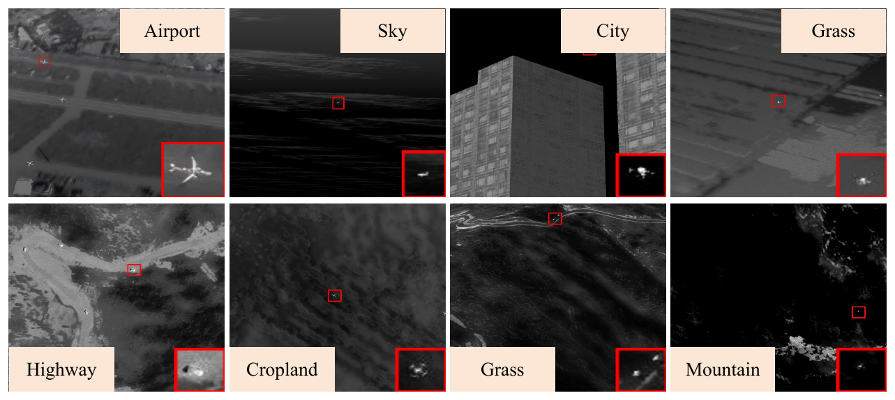
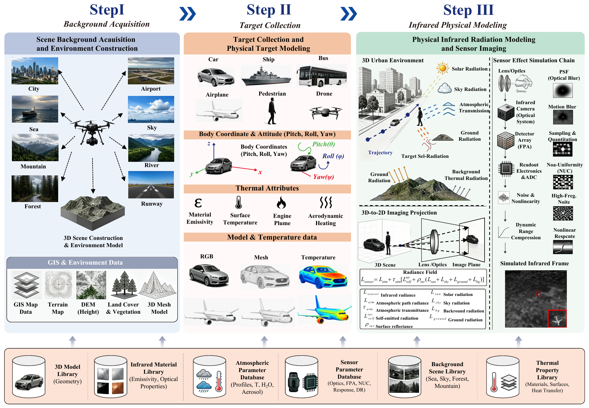
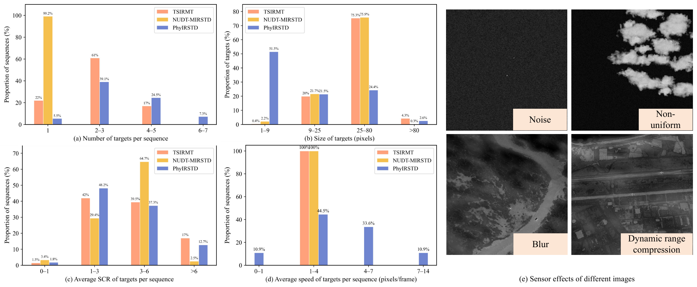
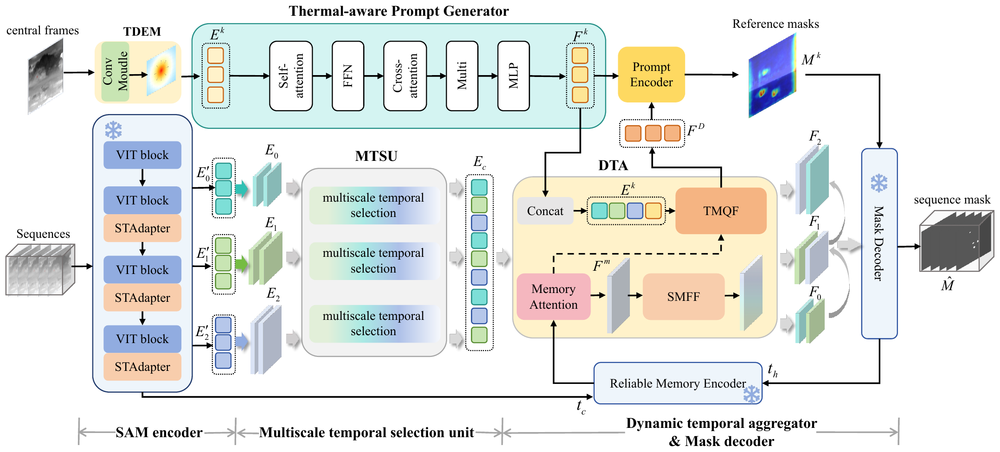

# *<center>PhyIRSTD: A Dynamic Temporal Aggregation Segment Anything Model for Moving Infrared Small Target Detection</center>*

## PhyIRSTD Dataset

***PhyIRSTD is a physics-based airborne benchmark for moving infrared small target detection (MIRSTD). It contains 110 sequences, 19,695 frames, and 78,018 annotated targets with both bounding-box and pixel-level mask annotations. Different from conventional target-background compositing, PhyIRSTD is generated through 3D scene reconstruction, physical target modeling, infrared radiation calculation, atmospheric transmission, and sensor imaging simulation.***<br>

<center></center>
Fig. 1 Overview and representative samples of the PhyIRSTD dataset. <br><br>

### Simulation Software

The **Complex Environment Infrared Scene Generation Software (XD_CAE-IR 1.0)** is an independently developed infrared simulation and analysis platform with proprietary intellectual property rights owned by the Key Laboratory of Optoelectronic Information Perception in Complex Environment, Xidian University. It adopts a unified framework for multidisciplinary and heterogeneous data processing and integrates structural, atmospheric, thermal, and infrared physical models into a complete pre-processing, solver, and post-processing workflow. Through efficient 3D scene modeling and physics-based radiative simulation, the software supports quantitative infrared analysis and dynamic scene rendering, and can generate both infrared and visible-light imagery under diverse scene, target, environmental, and sensor configurations.

Researchers who are interested in using **XD_CAE-IR 1.0** for academic research or related projects are welcome to contact us at **sgchen@xidian.edu.cn**.

### Physical Simulation

Fig. 3 illustrates the complete physical simulation pipeline used to construct PhyIRSTD. The pipeline contains three main stages: background acquisition and 3D environment construction, target collection and physical target modeling, and infrared physical modeling with atmospheric propagation and sensor imaging. This process enables the generated infrared sequences to preserve physically consistent relationships among scene geometry, target thermal properties, environmental radiation, and sensor response.

<center></center>
Fig. 3 Physical simulation engine for constructing PhyIRSTD. <br><br>

### Benchmark Properties

<center></center>
Fig. 4 Statistics and visualization of PhyIRSTD. <br><br>

### Downloads

The PhyIRSTD dataset can be downloaded from:

[[Google Drive]](https://drive.google.com/file/d/1TuYyio9olpbBPQf7sOlqYR73MrhRK2Tm/view?usp=sharing)

[[Baidu Netdisk]](https://pan.baidu.com/s/1XQA5uTC7pLOqLtB8jNTJ3Q?pwd=6v5e)  
Extraction code: `6v5e`

## DTA-SAM

### Overview

<center></center>
Fig. 5 The proposed architecture of DTA-SAM. <br><br>

### Commands for Training

**Single GPU**

```bash
CUDA_VISIBLE_DEVICES=0 python main.py \
  --dataset phyirstd --name dta_sam_phyirstd \
  --batch_size 8 --accumulation_steps 8 \
  --epochs 40 --augm_hflip --no_distributed
```

**Multiple GPUs**

```bash
CUDA_VISIBLE_DEVICES=0,1,2,3 torchrun --standalone --nproc_per_node=4 main.py \
  --dataset phyirstd --name dta_sam_phyirstd_4gpu \
  --batch_size 8 --accumulation_steps 2 \
  --epochs 40 --augm_hflip
```

### Commands for Inference

```bash
CUDA_VISIBLE_DEVICES=0 python inference.py \
  --dataset phyirstd \
  --resume output/dta_sam_phyirstd/checkpoint_best_iou.pth \
  --output_dir pred --name dta_sam_phyirstd \
  --threshold 0.5 --visualize --no_distributed
```

### Commands for Evaluation

```bash
CUDA_VISIBLE_DEVICES=0 python evaluate.py \
  --dataset phyirstd \
  --resume output/dta_sam_phyirstd/checkpoint_best_iou.pth \
  --output_dir pred --name dta_sam_phyirstd_eval --no_distributed
```
